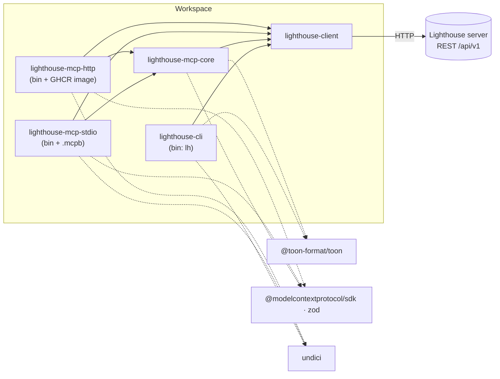

# lighthouse-clients — Architecture Overview

> **What this is.** The shape to hold in your head before changing anything in this repository: what each package owns, which way the dependencies point, how a Lighthouse API call becomes a CLI command and an MCP tool, and how a change gets released. It explains concepts and links out for the rest.
>
> **Where the rest lives.** Installing and using the packages: [`README.md`](README.md) and the package guides ([`packages/cli`](packages/cli/README.md), [`packages/mcp-stdio`](packages/mcp-stdio/README.md), [`packages/mcp-http`](packages/mcp-http/README.md)). Ownership and versioning rules: [`docs/release-model.md`](docs/release-model.md). Distribution channels: [`docs/deployment.md`](docs/deployment.md). The pipeline itself: [`.github/workflows/ci.yml`](.github/workflows/ci.yml).
>
> **Maintenance.** Keep this current with the general concepts — a new package, a new transport, a change to how connections or auth are resolved, a change to the release flow. Per-command and per-tool detail belongs in the package READMEs, not here.

---

## 1. In one paragraph

This is a pnpm workspace of five TypeScript packages that let people and AI agents talk to a running [Lighthouse](https://github.com/LetPeopleWork/Lighthouse) server over its REST API. One package knows the API (`client`); one turns it into a terminal tool, `lh` (`cli`); one turns it into a set of MCP tools (`mcp-core`); and two carry those tools over a transport — a local stdio process (`mcp-stdio`) or a shared Streamable HTTP endpoint (`mcp-http`). Every package is published to npm on its own version. Alongside them, [`skill/`](skill/) is an agent skill that teaches an AI assistant how to use these clients and how to read flow metrics. It ships as a release asset, not as code.

## 2. Packages and their boundaries

| Package (`@letpeoplework/…`) | Owns | Must not own |
| --- | --- | --- |
| `lighthouse-client` | Every HTTP call to Lighthouse: routes, auth headers, the connectivity check, standalone discovery, server-version gating, and the mapping of failures to error categories. Exposes one factory, `createLighthouseClient`, returning a `LighthouseClient`. Also the sentences both surfaces state a result in when Lighthouse's web pages have words for it, in the instance's terminology (`src/refinementWording.ts`), so `lh` and the MCP tools say exactly what the web says. | Anything about how a result is laid out: tables, columns, indentation, output formats. |
| `lighthouse-cli` | The `lh` binary: argument parsing, the connection wizard, the persisted config file, and the `pretty` / `json` / `toon` output. | Knowledge of API routes. It calls `LighthouseClient` methods only. |
| `lighthouse-mcp-core` | The MCP tool catalogue: names, descriptions, input schemas, read-only hints, and how each tool's arguments map to a client call and its result to text. Transport-agnostic. | Opening a socket or reading the environment. |
| `lighthouse-mcp-stdio` | Starting an MCP server on stdio for one local user, resolving the Lighthouse URL from the environment or the standalone lock file. Also builds the self-contained MCPB bundle. | Tool behaviour. |
| `lighthouse-mcp-http` | A Streamable HTTP MCP server: per-request credential pass-through, optional OAuth protected-resource metadata, `/health`, and the container image. | Tool behaviour. |

The rule behind the table, also stated in [`docs/release-model.md`](docs/release-model.md): domain behaviour goes in the shared packages (`client`, `mcp-core`), never in a transport adapter. The two MCP transports should differ only in how a request arrives and where its credentials come from.

## 3. Dependency direction

Dependencies point one way: towards `client`. Nothing depends on `cli`, and `cli` and the MCP packages never import each other. Internal dependencies use `workspace:*`.

Two details are deliberate:

- **`mcp-core` does not construct a client.** It declares the slice of the client it needs as its own structural type (`McpRuntimeClient`) and receives a `createClient()` function through `McpCoreRuntimeDependencies`. Each transport decides the URL, the credentials and the `fetch` to use, then hands `mcp-core` a factory. That is what lets `mcp-http` build a client per inbound request with the caller's own credentials.
- **The CLI works the same way.** `runCliCommand(args, dependencies)` in `cli/src/index.ts` is pure orchestration over a `RunCliCommandDependencies` object (load/save connection, prompt, read a file, create a client, …). `cli/src/bin.ts` is the only place that touches the file system, `process.env`, stdin and `undici`. Tests swap the dependencies object rather than mocking modules.

## 4. How a call flows

1. **`client`.** Each `LighthouseClient` method maps to one `/api/v1/…` route. Every request first runs the connectivity check (`GET /api/v1/version/current`) against the resolved endpoint, then makes the real call. Methods never throw for HTTP failures: they return `LighthouseApiResult<T>`, either `{ ok: true, value }` or `{ ok: false, error: { category, reason, statusCode? } }`. The category (`unreachable`, `misconfigured`, `unauthorized`, `dependency-failure`, `concurrency-conflict`, `unexpected`) comes from the status code. A 409 becomes `concurrency-conflict`, with guidance to re-fetch and re-apply.
2. **Server-version gating.** Endpoints that only newer Lighthouse servers have are listed in `FEATURE_REQUIRES_SERVER_NEWER_THAN`, each with the last server version that did *not* have it. Before calling a gated route, the client reads the server version once per client instance and, if the server is too old, returns a `misconfigured` error that says which upgrade is needed. A version string it cannot parse (a dev build, say) never blocks.
3. **CLI.** A group handler parses options, calls one or more client methods, and passes the result through `mapApiResultToCliResult`. That formats a success in the chosen output format and turns a failure into `category: reason` on stderr with exit code 1.
4. **MCP.** `createMcpCoreRuntime().callTool(name, args)` validates the arguments, calls the client, and returns a single text block: TOON-encoded on success (falling back to JSON if TOON cannot encode the value), `isError: true` with the category and reason on failure. `registerMcpTools` registers every definition on an `McpServer` with its zod input schema and annotations.

The two surfaces are close but not identical. The CLI's `lh metrics team|portfolio --metrics a,b,…` fans out into several client calls and returns one combined payload, while MCP has one tool per metric. The CLI can create, update and delete teams and portfolios from a JSON payload (`--payload-json` / `--payload-file`); MCP exposes only list, get and refresh for them. Blackout rules have create, update and delete on both surfaces.

## 5. Connection and auth resolution

Each surface resolves "which Lighthouse, as whom" differently, because each runs in a different setting:

| Surface | Where the URL comes from | Where the credential comes from |
| --- | --- | --- |
| `lh` | The saved connection in the config file: `$LIGHTHOUSE_CLI_CONFIG_PATH`, or `~/.config/lighthouse-clients/cli-config.json`. It is written by `lh connection connect` and stored with mode `0600`. A `standalone` connection re-reads the standalone lock file on every request. | `LIGHTHOUSE_API_KEY` if set, otherwise the API key saved with the connection. Standalone connections send no credential. |
| `mcp-stdio` | `LIGHTHOUSE_URL`, otherwise the standalone lock file, read once at startup. With neither it exits with `Failed to resolve Lighthouse URL`. | `LIGHTHOUSE_API_KEY`, or none. |
| `mcp-http` | `LIGHTHOUSE_URL`, required. Without it the process exits with `Missing LIGHTHOUSE_URL`. | Per request: the caller's `X-Api-Key` header, else the caller's `Authorization: Bearer` token, else the server's own `LIGHTHOUSE_API_KEY` as a fallback, else none. |

The **standalone lock file** (`standalone.lock.json`, a versioned contract carrying `lighthouseUrl`) is written by a locally running Lighthouse desktop app. It lives in the per-OS application-data folder: `~/Library/Application Support/Lighthouse` on macOS, `%APPDATA%\Lighthouse` on Windows, and `$XDG_CONFIG_HOME/Lighthouse` (or `~/.config/Lighthouse`) elsewhere. `LIGHTHOUSE_STANDALONE_LOCKFILE_PATH` overrides the location. CI uses that override to prove that `mcp-stdio` fails cleanly when no lock file exists.

An API key goes out as `X-Api-Key` and a bearer token as `Authorization: Bearer …` (`getAuthHeaders` in `client`).

**Who votes.** A refinement vote or comment on a Lighthouse with sign-in is the signed-in account's, and the client sends no name. Without sign-in it carries the voter's name and a voter key (`X-Lighthouse-Voter-Key`), which is what lets that voter take the vote back later. `lh` keeps the name in its config file (`lh config voter set --name …`) and takes `--as` over it; it never derives one from the OS user, git or the host name. The key is minted on the first write (`mintVoterKey` in `client`: 32 random bytes, 43 characters) and kept in `voter-keys.json` beside the CLI's config file (the directory of `$LIGHTHOUSE_CLI_CONFIG_PATH`, or `~/.config/lighthouse-clients/`), mode `0600`, one key per Lighthouse: the server's URL, or `standalone` for a standalone connection, because the desktop app may come back on another port and is still the same Lighthouse. The store is `createFileVoterKeyStore` in `client`, not part of the CLI's config file, so that `mcp-stdio` can share it: it keeps its key in the same file, under its `LIGHTHOUSE_URL` or, when it found Lighthouse through the lock file, under `standalone`. A person is then one voter on a Lighthouse whichever of the two they vote from, rather than two voters under one name, and either can take back what the other cast. The MCP tools take the name per call (`voterName`) and keep none. `mcp-http` keeps no key: it serves many people, so without sign-in it could not tell them apart. Before a vote, comment or take-back it asks Lighthouse's auth mode (`queryServerAuthMode`) and, when sign-in is off, refuses and points to the web page, `lh` or a local MCP server; with sign-in each caller's own credential votes.

**TLS.** The CLI verifies certificates unless the connection was saved as `insecure` (`--insecure`, or answering yes in the wizard after a failed HTTPS check). Both MCP transports always skip certificate verification. Their READMEs document this.

The `client` package also exports a few auth helpers that no package in this repository uses yet: `createLighthouseAuthContext` and the browser-session functions `startCliAuthSession` and `pollCliAuthSession` (`queryServerAuthMode` is used only by `mcp-http`, above). The CLI wires an `openBrowser` dependency but never calls it. Only their own unit tests exercise them.

## 6. The two MCP transports

- **stdio** runs one `McpServer` for the life of the process, for one local user. It is launched by the MCP client (`npx -y @letpeoplework/lighthouse-mcp-stdio`) or installed from the **MCPB bundle**. The build emits a third, fully bundled CommonJS entry (`dist/mcpb-runtime.cjs`, from `src/mcpb-launcher.ts`), and the release job packs it with `mcpb/launcher.cjs` and `mcpb/manifest.json` into `lighthouse-mcp-stdio.mcpb`, so it runs without npm. The manifest maps the user's settings onto `LIGHTHOUSE_URL` and `LIGHTHOUSE_API_KEY`.
- **HTTP** is stateless. Every `POST /mcp` (or `POST /`) gets a fresh `McpServer` and a `StreamableHTTPServerTransport` with no session id. Its client is built from that request's credentials, so each caller acts on Lighthouse as themselves. `GET /health` answers `{"status":"ok"}`, and everything else is a 404. It listens on `HOST` (default `127.0.0.1`) and `PORT` (default `3333`).
- **OAuth on HTTP** is optional and switched on by setting both `LIGHTHOUSE_OAUTH_ISSUER` and `LIGHTHOUSE_OAUTH_RESOURCE`. Setting only one is a startup error. When it is on, the server checks at startup that the Lighthouse server is new enough (the `mcpOAuthPassThrough` gate). It serves RFC 9728 protected-resource metadata at `/.well-known/oauth-protected-resource` and at the same path with `/mcp` appended, and answers a credential-less MCP request with `401` plus a `WWW-Authenticate` header pointing at that metadata. The metadata URL honours `X-Forwarded-Proto` and `X-Forwarded-Host`, so it stays correct behind a TLS-terminating ingress. The server never validates tokens itself: it forwards them, and Lighthouse decides.
- **Container.** [`packages/mcp-http/Dockerfile`](packages/mcp-http/Dockerfile) copies the already-built `dist/` of `mcp-http`, `mcp-core` and `client` onto `node:24-alpine` and installs production dependencies, so build before `docker build`. The image is published to `ghcr.io/letpeoplework/lighthouse-clients/mcp-http` (section 10).

## 7. Conventions

- **CLI shape: `lh <group> <subcommand> [--options]`.** The groups are `connection`, `team`, `portfolio`, `metrics`, `delivery`, `blackout`, `forecast`, `worktracking`, `feature`, `refinement`, `config`, `health`, `version` and `help`. Each group has a `run<Group>Group` handler and a `get<Group>GroupHelpText`. Running a group with no subcommand prints its help, and an unknown subcommand prints that help as an error. Ids are flags (`--id`, `--portfolio-id`, `--team-id`); write payloads come from exactly one of `--payload-json` or `--payload-file`.
- **Output formats.** `--pretty` (the default: an indented, human-readable view that labels records as `name [id: n]`), `--json` (compact `JSON.stringify`) and `--toon` (Token-Oriented Object Notation, compact for LLM input). Giving more than one is an error. `lh config output set --format …` stores a default in the same config file. All of this lives in `cli/src/output.ts`. A command may pass its own pretty renderer (`PrettyRenderer`) to `mapApiResultToCliResult`; it replaces the generic view for `--pretty` only, and `--json` / `--toon` still hand over the facts unchanged. Only `lh refinement get` has one so far (`cli/src/refinementOutput.ts`); every other command uses the generic view.
- **MCP tool names: `lighthouse_<area>_<verb>`**, for example `lighthouse_team_list`, `lighthouse_portfolio_refresh` and `lighthouse_forecast_backtest`. Metric tools insert the scope: `lighthouse_<team|portfolio>_metrics_<metricName>`, with the metric in camelCase (`lighthouse_team_metrics_cycleTimePercentiles`). The name is a closed union type, `McpToolDefinition["name"]`.
- **The verb suffix sets the annotations.** A tool ending in `_refresh`, `_create`, `_update` or `_delete` is registered with `readOnlyHint: false` and `idempotentHint: false`, and every other tool as read-only and idempotent (`isReadOnlyTool`). A write whose name ends in another verb is listed in `WRITING_TOOLS` instead, as the refinement `_vote`, `_comment` and `_voteTakeBack` tools are. Name a writing tool with one of the suffix verbs or add it to that list, or MCP clients will treat it as safe to call freely; `runtime.test.ts` pins every tool's annotations.
- **Tool result text starts with a short label** (`teams: …`, `backtest: …`). Errors carry `<label>: <category> (<reason>)`.
- **No exceptions across package boundaries for expected failures.** Use `LighthouseApiResult` in `client`, `CliCommandResult` (`exitCode`, `stdout`, `stderr`) in `cli`, and `McpToolResult` (`isError`) in `mcp-core`.
- **One source file per concern.** Each package keeps most of its logic in a single large `src/index.ts`. The entry points are `src/bin.ts` (CLI and transports), `cli/src/output.ts` and `mcp-stdio/src/runtime.ts`. Each package also exports a `get…PackageContract()` describing its role, which its `index.test.ts` pins.

## 8. Adding a capability end to end

Take a new Lighthouse endpoint you want available both in `lh` and as an MCP tool.

1. **`client`.** Add the method to the `LighthouseClient` type and implement it in `createLighthouseClient` with `requestJson`, `requestText` or `requestNoContent` on the `/v1/…` route. If older servers lack the endpoint, add an entry to `FEATURE_REQUIRES_SERVER_NEWER_THAN` (the last released server version *without* it) and call `ensureServerSupports` first. Cover it in `client/src/runtime.test.ts` with an injected `fetch`.
2. **`cli`.** Add the method name to the `CliDomainClientLike` pick, then handle the subcommand in the right `run<Group>Group` (or add a group to `runCliCommand` and to the top-level usage text) and update its help text. Cover it in `cli/src/commands.test.ts`, and document it in `packages/cli/README.md`.
3. **`mcp-core`.** Add the name to the `McpToolDefinition["name"]` union, a definition (description and JSON schema) to `toolDefinitions`, a zod schema to `toolInputSchemas` (the `Record` type makes a missing one a compile error), the method to the `McpRuntimeClient` structural type, and a branch in `callTool`. Pick the verb with section 7 in mind. Cover it in `mcp-core/src/runtime.test.ts`.
4. **Transports.** Normally nothing to do: both pick the new tool up through `registerMcpTools`.
5. **`skill/`.** If agents should know about it, add it to `skill/SKILL.md`'s command and tool references.
6. **Changesets.** Run `pnpm changeset` and name every package you touched (section 10).

## 9. Tests

- **Runner.** A single root [`vitest.config.ts`](vitest.config.ts) runs `packages/*/src/**/*.test.ts`. It aliases every `@letpeoplework/lighthouse-*` import to that package's `src/index.ts`, so tests run against source with no build step. Tests sit beside the code they cover.
- **Style.** Mostly dependency injection, not module mocking: `client` tests pass a fake `fetch` through `LighthouseClientDependencies`, `cli` tests pass a fake `RunCliCommandDependencies` with a stub client, and `mcp-core` tests pass a stub `createClient`. The `bin.*.test.ts` files cover the runtime edges: environment handling, the insecure dispatcher (mocking `undici`), and OAuth.
- **In-process end-to-end.** `mcp-http/src/bin.*.e2e.test.ts` start the real HTTP server and a tiny `node:http` upstream that records the headers it receives, then drive it with the MCP SDK's client. This is how credential pass-through and the OAuth challenge are proven.
- **Post-release smoke, in CI only.** On main, after publishing, `smoke-platform` installs the just-published CLI from npm on Linux, macOS and Windows and runs it against [`scripts/smoke-fixture.mjs`](scripts/smoke-fixture.mjs), a minimal fake Lighthouse. `smoke-integration` runs it against a real `ghcr.io/letpeoplework/lighthouse:latest` container seeded with demo data. The `verify` job also checks that both MCP bins start and fail with the expected message when unconfigured.

## 10. Build, lint and release

- **Toolchain.** pnpm (version pinned by `packageManager`), Node ≥ 22, TypeScript 7 with project references (`pnpm typecheck` runs `tsc -b`).
- **Build: tsdown.** Libraries are built as dual ESM and CJS with `.d.ts` files. Each binary (`lh`, `lighthouse-mcp-stdio`, `lighthouse-mcp-http`) is a separate ESM entry with a `#!/usr/bin/env node` banner and a `fix-shebang.mjs` postbuild step. The `mcp-http` binary inlines the workspace packages, and the MCPB runtime inlines everything. The CLI's build script builds `client` first. The release job additionally compiles `cli/src/bin.ts` into standalone binaries with Bun.
- **Lint and format: Biome.** [`biome.json`](biome.json) uses the recommended preset and 2-space indentation over the whole tree except build output and `package.json` files. Run `pnpm lint` or `pnpm lint:fix`.
- **Local gate.** The `simple-git-hooks` pre-commit hook runs `pnpm run ci` (lint, test, typecheck, build) and then [`scripts/check-changeset.mjs`](scripts/check-changeset.mjs). The changeset check blocks a commit that touches `packages/<name>/src/` or `packages/<name>/package.json` without staging a new `.changeset/*.md`. Set `SKIP_SIMPLE_GIT_HOOKS=1` to bypass it in an emergency.
- **Release: Changesets, with the version bump done by hand.** Each package is versioned on its own, and a dependent gets a patch bump when an internal dependency moves (`updateInternalDependencies: patch`). The CI release job **does not run `changeset version`**: it only runs `changeset publish`, which publishes whatever versions in the manifests are not yet on npm. So before pushing a release to main, run `pnpm release:version` locally (with `GITHUB_TOKEN_CHANGESET` set, for the GitHub-linked changelog), review the bumped `package.json` and `CHANGELOG.md` files, and commit them. History calls these commits `chore(release): version packages — …`.
- **The pipeline** is the single [`ci.yml`](.github/workflows/ci.yml) ("Client CI"). `verify` runs on every PR and push. On main, the `release` job then waits for approval in the `Release` environment. Only the newest pending run is kept, so approving never ships a stale commit. On approval it publishes to npm with provenance (OIDC trusted publishing), builds the Bun binaries, the MCPB bundle and `lighthouse-skill.zip`, and creates a GitHub Release tagged `v<YYYY.MM.DD>.<run number>` carrying those plus the install and uninstall scripts. It pushes the `mcp-http` image to GHCR as `<mcp-http version>` and `latest`, skipping the push if that version tag already exists. The two smoke jobs run last.
- **Dependency updates** come from Renovate, which auto-merges once CI is green and opens PRs without a changeset. They reach users with the next release of the affected package ([`docs/release-model.md`](docs/release-model.md)).

## 11. `skill/`

[`skill/SKILL.md`](skill/SKILL.md) plus `skill/references/` (`lighthouse-mechanics.md`, `flow-metrics.md`, `coaching-patterns.md`) form an agent skill named `lighthouse`. It does two jobs: it tells an assistant how to reach Lighthouse (connected MCP tools first, then stdio, then HTTP, then the `lh` CLI) and how to call the tools correctly (id resolution, batching, forecast workflows), and it carries the flow-metrics coaching guidance used to interpret the results. It is plain Markdown with no build step. The release job zips the folder into the `lighthouse-skill.zip` release asset. Because it names CLI commands and MCP tools, keep it in step when either surface changes.
